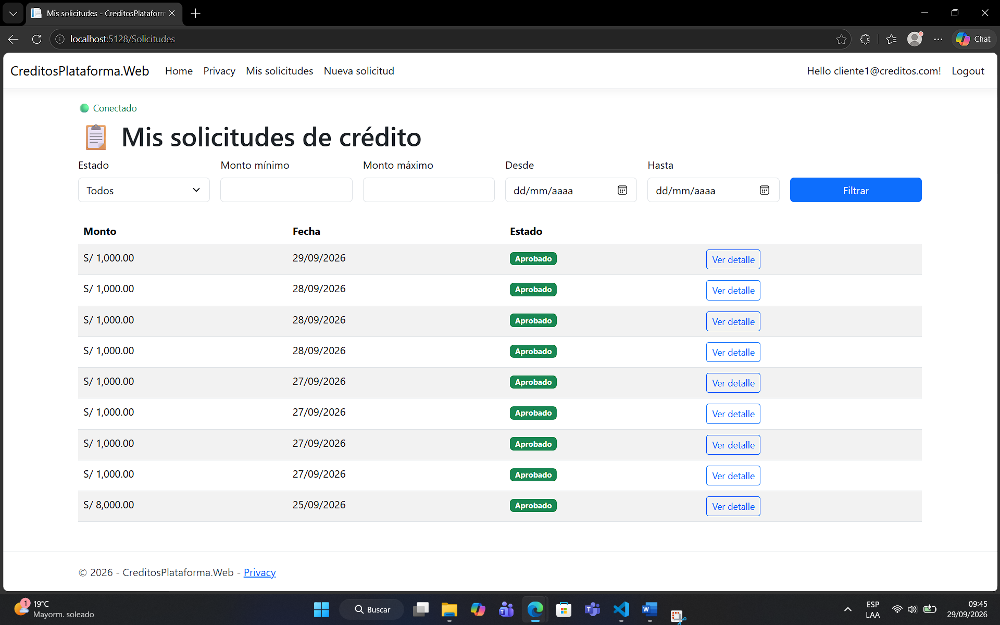
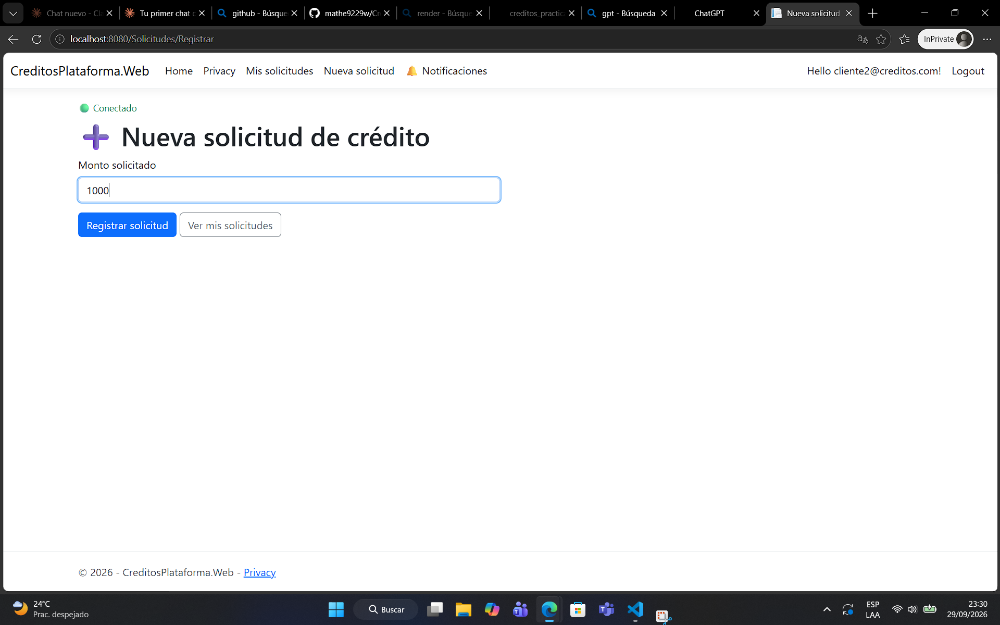
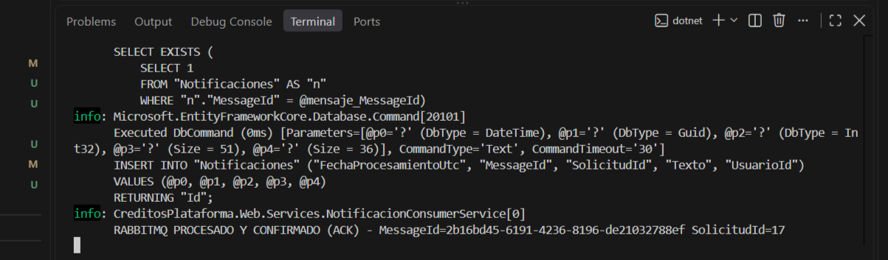

# 💳 Plataforma de Créditos

Aplicación MVC en .NET 10 con Identity, EF Core + SQLite, sesión y caché con Redis, notificaciones en tiempo real con SignalR, y mensajería asíncrona con RabbitMQ (CloudAMQP).

## 🔗 Enlaces

| Recurso | URL |
|---|---|
| 📦 Repositorio GitHub | https://github.com/David-Clouds/creditos_practica |
| 🌐 Aplicación en Render | https://creditos-practica.onrender.com |

## Tecnologías

- .NET 10 (ASP.NET Core MVC + Identity)
- EF Core + SQLite
- Redis Cloud — sesión y caché de solicitudes
- SignalR — notificaciones en tiempo real (evento `SolicitudEstadoActualizado`)
- RabbitMQ (CloudAMQP) — publicador con confirmaciones + consumidor con ACK manual e idempotencia
- Docker + Render

## Usuarios de prueba

| Rol | Email | Password |
|---|---|---|
| Analista | analista@creditos.com | Analista123! |
| Cliente | cliente1@creditos.com | Cliente123! |
| Cliente | cliente2@creditos.com | Cliente123! |

## Cómo correr localmente

\`\`\`bash
dotnet restore
dotnet ef database update
dotnet run
\`\`\`

Antes de correr, configura tus propios secretos locales (nunca en este repo):

\`\`\`bash
dotnet user-secrets init
dotnet user-secrets set "Redis:ConnectionString" "TU_CONNECTION_STRING_DE_REDIS"
dotnet user-secrets set "RabbitMq:ConnectionString" "TU_URL_AMQP_DE_CLOUDAMQP"
dotnet user-secrets set "RabbitMq:QueueName" "solicitudes.notificaciones"
dotnet user-secrets set "RabbitMq:ConsumerEnabled" "true"
\`\`\`

## Configuración por variables de entorno (Render)

Ninguna clave está en el código ni en este README. En Render se configuran como variables de entorno (usa `__` en vez de `:`):

| Variable | Uso |
|---|---|
| `Redis__ConnectionString` | Sesión y caché de solicitudes |
| `RabbitMq__ConnectionString` | Publicador y consumidor de mensajería |
| `RabbitMq__QueueName` | Nombre de la cola (`solicitudes.notificaciones`) |
| `RabbitMq__ConsumerEnabled` | `true` para habilitar el consumidor en este proceso |
| `PORT` | Provista automáticamente por Render |

## Funcionalidades por pregunta

1. Bootstrap: Identity, EF Core + SQLite, modelo de dominio
2. Catálogo de solicitudes con filtros
3. Registro de solicitudes con validaciones de negocio
4. Sesión y caché con Redis
5. Panel de analista: aprobar/rechazar con regla de 5x ingresos
6. Notificaciones en tiempo real con SignalR (`SolicitudEstadoActualizado`, reconexión con consulta de estado vigente)
7. Mensajería con RabbitMQ: publicador con confirmaciones, consumidor con ACK manual e idempotencia por `MessageId`, vista "Mis notificaciones"

## Evidencias

## Panel del analista

## Clientes

## Solicitudes

## Analista Acepta

## Notificaciones Cliente

## Cloud_amqp

